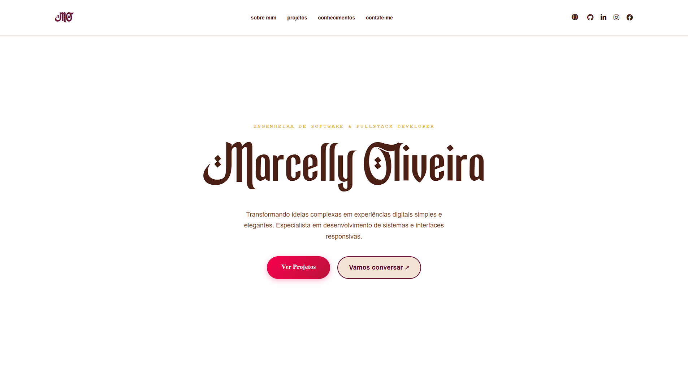

# 🚀 Portfólio Pessoal

Bem-vindo(a) ao repositório do meu portfólio! Este projeto é a minha "vitrine digital", onde reúno meus melhores projetos, minhas habilidades técnicas e um pouco da minha trajetória como desenvolvedor(a).

---

## 📌 Sobre o Projeto

A ideia deste site é centralizar tudo o que venho construindo. Mais do que apenas um currículo, ele é um espaço onde demonstro como resolvo problemas reais através do código e como busco evoluir constantemente.

**O que você encontrará aqui:**

* **Projetos em destaque:** Aplicações reais com links para demonstração.
* **Minha Stack:** As tecnologias que domino e as que estou aprendendo.
* **Experiência e Educação:** Meu histórico profissional e acadêmico.
* **Contato:** Formas diretas de falar comigo.

---

## 🛠️ O que foi usado para construir?

Para este projeto, escolhi ferramentas que permitem uma experiência rápida, moderna e responsiva (que funciona bem tanto no computador quanto no celular):

* **Frontend:**  HTML5 / JavaScript
* **Estilização:** CSS 
* **Hospedagem:** Vercel

---

## 💻 Como visualizar

Você pode acessar o portfólio online através do link abaixo:

👉 **<a href="https://marcelly-oliveira.vercel.app/">Pórtifolio Marcelly Oliveira</a>**

---

## 📫 Vamos conversar?

Se você gostou do meu trabalho ou quer trocar uma ideia sobre tecnologia, sinta-se à vontade para me chamar:

* **LinkedIn:** <a href="https://www.linkedin.com/in/marcelly-oliveira-4a89a3301/">Marcelly Oliveira</a>
* **E-mail:** marcellyoliveirads@gmail.com
* **Outras redes:** <a href="https://www.instagram.com/ray_ol1/">Marcelly Oliveira</a>

---

### ⭐ Créditos

Se este projeto te inspirou de alguma forma, não esqueça de deixar uma **estrela (star)** no repositório!

---

